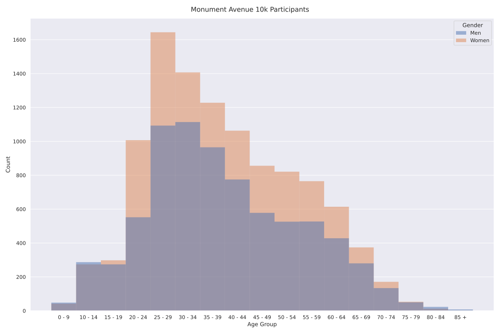
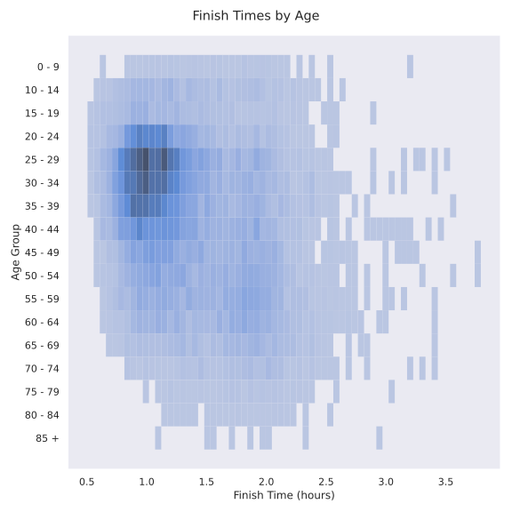
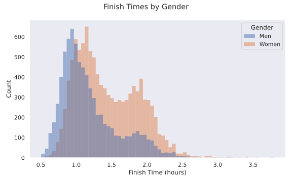
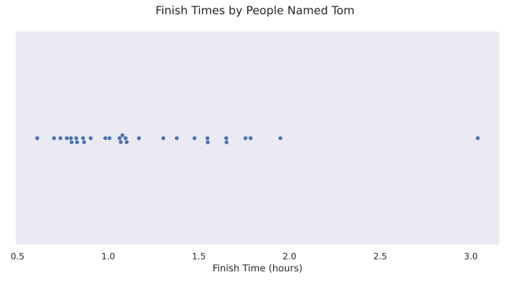

# Monument Avenue 10k

I ran the local 10k for the first time in years recently. When I got my results back I thought it'd be fun to make some charts based on the race results, and so I did.

Turns out a lot more women ran this race than men.

And there were a good spread of ages running.

An interesting bimodal distribution pops up here. I'd imagine it's the division of runners and walkers.

Here's a graph of the finishing time of those with the most popular names in the race. People named Ryan and Matthew are pretty fast. People named Mary have the slowest median time of those with popular names.

Tom's got a nice spread.

