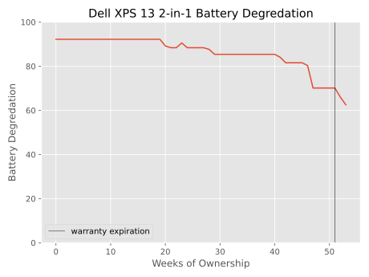
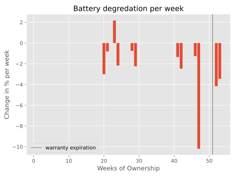

**Background:** My laptop battery was real poor. Too poor. And it seemed to get that way right after my warranty expired. Was big computer using their smarts to offer a warranty period that would fail to cover the most common time a battery started to fail? I had to know.

Luckily for my curiosity, Windows has an option to get the current health of your battery, as well as how it has changed over time. A little command `powercfg /batteryreport /output "C:\battery-report.html` does all the heavy lifting. I copy and pasted the weekly table from that command and created a little python script to parse and graph the results. Unfortunately that `battery-report.html` was lost to the silicon of time and I don't have the original data anymore, so graphs will have to suffice. 

From the graph below we can see the battery appears to not start at the full capacity, which I'm not entirely sure as to why. There's also a bump up in capacity around 22 weeks for some reason. But the real meat and potatoes of this image is at around 45 weeks. It just starts to tank going from 80% capacity to 60% in about 10 weeks. That also happens to coincide with when the 52 week warranty ends. Interesting! This mildly supports my hypothesis that big computer doesn't want to pay out on their warranties. I just need a couple more hundred people to make sure I wasn't a fluke!

Here's a graph of the weekly change. A ten percent decrease in a week is no joke. I can only wonder if it was left out in the sun at some point around that time.

Anyway reach out to me if this is enough evidence for a class action.
