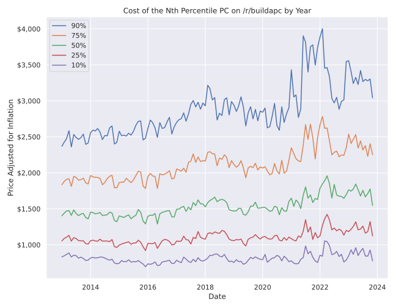
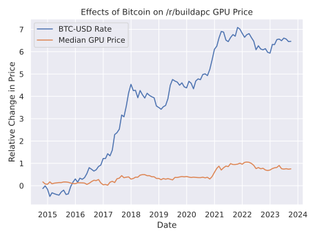

# A Tale of /r/buildapc

There's going to be a bit of preamble to this one, so feel free to scroll to the part with images if you want to get to the good stuff.

## Preamble

A while ago (2013) I built my first ever computer with the help of the fine folks on [/r/buildapc](https://reddit.com/r/buildapc) and [pcpartpicker.com](https://pcpartpicker.com). The latter website allowed one to post to the former website by exporting their "build" as a markdown table. These markdown tables became little archives for posterity, because while the databases on pcpartpicker are constantly updating and changing to reflect the real time price of a certain part, those markdown tables have been the same for ages and reflect how much was paid for each part at the time of purchase. Look back on [some of the first builds](https://pcpartpicker.com/builds/#sort=-recent&page=1) on pcpartpicker and you'll see that most of the prices for parts aren't listed anymore because they're not for sale anymore!

With this thought in mind, I wanted to scrape all the markdown tables from the buildapc subreddit to see how PC builds have changed since I built my first computer. Are people spending more on computers? Are more people building computers? What stores are most prevalent? What parts? Do people spend more on GPUs or CPUs? Does this change based on how much you spend overall? How much did a top of the line CPU cost in 2013 vs now? How quickly did SATA SSDs take over HDDs, and then NVMEs over SATA SSDs? I wasn't able to answer all of these questions because of lack of time and education (which is really just another lack of time if you think about it), but I'm happy to say that I figured out enough to satiate my appetite for now, and I hope to share these finding with all of you.

## Some Methods

No doubt a few of you are wondering "Where did you get this cornucopia reddit data, didn't they recently [paywall their api](https://www.reddit.com/r/reddit/comments/12qwagm/an_update_regarding_reddits_api/), and shut down the [largest archive](https://www.reddit.com/r/modnews/comments/134tjpe/reddit_data_api_update_changes_to_pushshift_access/) of reddit data on the web? Well that's partly right, and why I only have data going to December 2022, but there are torrents out there, and my curiosity took me to the high seas. I'm not using any of this data for commercial purposes, so hopefully reddit's lawyers don't come after me, but even if they do I have little to give. 

All that said, it was quite the exercise downloading 2TiB of reddit data. Luckily I had enough space on my NAS for such a dataset, unluckily I didn't find out until after downloading the whole dataset that there are per subreddit datasets that are *much* smaller than the entirety of reddit. Unfortunately even the smaller dataset with just buildapc submissions didn't fit in my laptops RAM, fortunately I got to learn about chunking pandas dataframes!

I won't bore you with all the details, since at this point in the process you can just look through the code, but the general outline of the data's flow is:

    buildapc_submission.json (8GiB) -> part_table.csv (1.26GiB) -> part_table_cleaned.csv (951MiB)

The first file was the raw reddit submission data. The second file extracts the markdown tables from each submission (if there) converts them into a csv. The third file does additional processing on the second file, and turns all the data into usable field information that can easily be imported into a pandas dataframe. Unfortunately due to github's upload limits, none of the files will be uploaded here (even the last file compressed is ~100MiB), but you can reach out to me if you're interested.

## What I learned

Now we're onto the fun part, or should I say parts. I've broken the following into easily digestible sections to cater to those of all attention spans.

### Part 1 - Price

The first question I had at the beginning of all of this was "How much does a PC cost?" Then you start to ask yourself "How much does an expensive/cheap PC cost?" Naturally the next question you have is, "Well how much does a PC in the 10th, 25th, 50th, 75th, and 90th percentile cost from January 2013 to December 2022?" My friend, this is your answer:

Since prices are adjusted for inflation, the graph shows whether or not the prices of computers in each percentile were rising slower/faster than inflation. For the first several years we don't see too much of a change, then a slight rise in 2017-18 and fall in 2019 and the beginning of 2020. After that computer prices skyrocket. I wonder what could cause such a phenomenon? It instructive to note that while the 90th percentile definitely has the biggest jump in terms of absolute price, things might look a little different if we compared to relative pricing (ie change compared to previous point in the time series) but that a project for me with more time!

Now that you know how much a computer costs, you might start to wonder how much a computer part cost, and how much does it cost with respect to the rest of the computer? Well there's an answer for that as well!

### Part 2 - GPUs and Bitcoin

When posting the graphs from the previous section [to reddit](https://www.reddit.com/r/dataisbeautiful/comments/16hlqbf/a_10_year_price_breakdown_of_computers_posted_to/) one of the thread's commentors wondered if there was a correlation between GPU price and the Bitcoin-USD exchange rate. This wasn't something I had really thought about, but I did know it would be easy enough to figure out considering I had *almost* all the data at my finger tips. The only piece missing was historical BTC-USD data. Fortunately for me yahoo finance had such data in [an easily downloadable format](https://finance.yahoo.com/quote/BTC-USD/history?period1=1410825600&period2=1695168000&interval=1d&filter=history&frequency=1d&includeAdjustedClose=true). 

With my new csv file in hand, it was pretty easy to aggregate data into pretty looking graphs. The first compares the relative change in the price of GPU and BTC-USD exchange rate.

I'll admit this first graph is a bit obscure to understand, but it's a cumulative sum of the relative change of the price. The left axis can basically be read as "how many times has the price doubled since the starting point". In this example the bitcoint exchange rate starts at ~$465 and peaks at ~$60k which is about 7 doublings of price! The median GPU price only tops out at one doubling of price. This is essentially just a log plot of the price change. The next graph is much easier to understand, I promise!

Yup, this one just plots the price of a bitcoin in USD to the median GPU price. It seems there's a rather strong correlation, but you know what they say about those. That being said, still interesting data nonetheless.

 
And that's where I'll leave you today.
