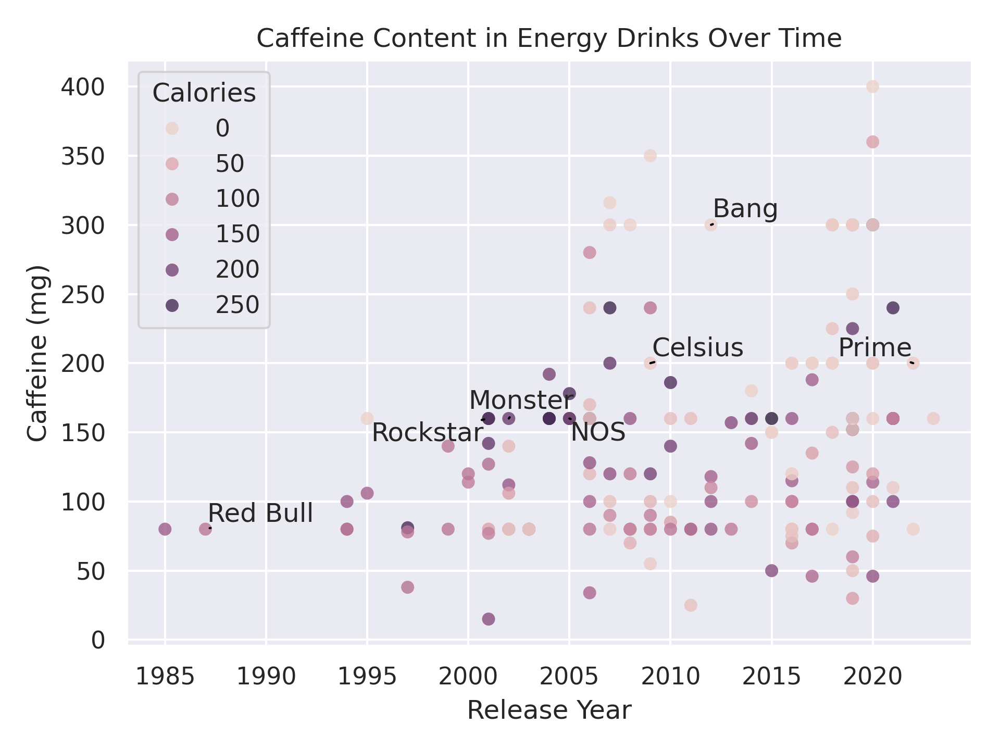

**Background:** I saw [a post](https://www.reddit.com/r/dataisbeautiful/comments/18cyoib/oc_caffeine_content_of_energy_drinks_over_time/) on [/r/dataisbeautiful](reddit.com/r/dataisbeautiful) about how the caffeine content has been increasing over time. Seeing as a consume a fair amount of caffeine I decided to download the source data and make a few of my own graphs!

The source of the caffeine content data is from [caffeineinformer.com](https://www.caffeineinformer.com/the-caffeine-database), and the source for the release year data is from FTL Data in their post entitled [High on caffeine](https://data.ftl.studio/posts/high-on-caffeine).

This first image is just a slight variation of the original post from reddit. 

**TODO**

* Horizontally alight multiple legends. Might require editing seaborn source code.
* Types of energy vs caffeine content
