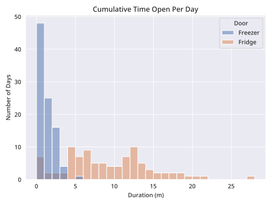

**Background:** One day I noticed the fridge was leaking from the inside, and when searching for the reason that might be have caused this, I found that leaving the fridge open was usually the main culprit for this problem. Being that I have 2 roommates and a fridge with no door alarm, I though that could definitely be the case, so I added some contact sensors to the fridge and freezer doors, and then set an automation via [home assistant](https://www.home-assistant.io/) to tell our smart speakers to alert us when the fridge was left open. Unfortunately the home assistant database has a default retention of ~10 days so I don't have any data from that time to compare how long the fridge/freezer were left open before and after the automation was implemented, but I can say it made our leak disappear so in that sense it was a success!

What is graphed below is ~100 days of data (I changed the home assistant retention) from October 2022 to February 2023. It's a little slice of life of the fridge and freezer use of two people working from home, and one person usually working in office from Tuesday-Saturday. The data itself lines up with what I think the data should be, it generally lines up with our sleep schedules, and highly variable snacking schedules. One thing I thought might be interesting is to add an energy sensor to the fridge and compare the cumulative time that the fridge/freezer were open with the energy that the fridge was using that day. You can find those graphs below!

As a final note before we get into the graphs, this was more an exercise to practice with sql and seaborn than anything, so if you do decide to peruse the code, please take that into account. Very few best practices were followed, and even less documentation was written. This code could theoretically be reused with some changes to make your own graphs using data from you home assistant database, but it probably wouldn't be a fun endeavor. 

Without further ado, here are some graphs!

Here's one tracking every time I opened the fridge over that period, grouped by day of the week and time of day.

Yet another graph, this one showing how long the fridge or freezer was open each time they were opened.

Here's one showing the **cumulative** amount of time the fridge was opened per day.

Here's one with a comparison of how long the door was opened vs the cost (at $.14/kWh)

More pictures were created, you can find them all in the Images folder. They *should* be pretty clearly titled.
