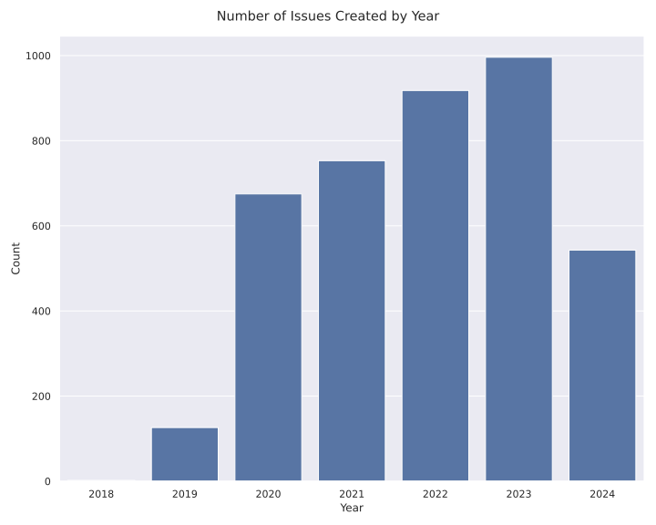
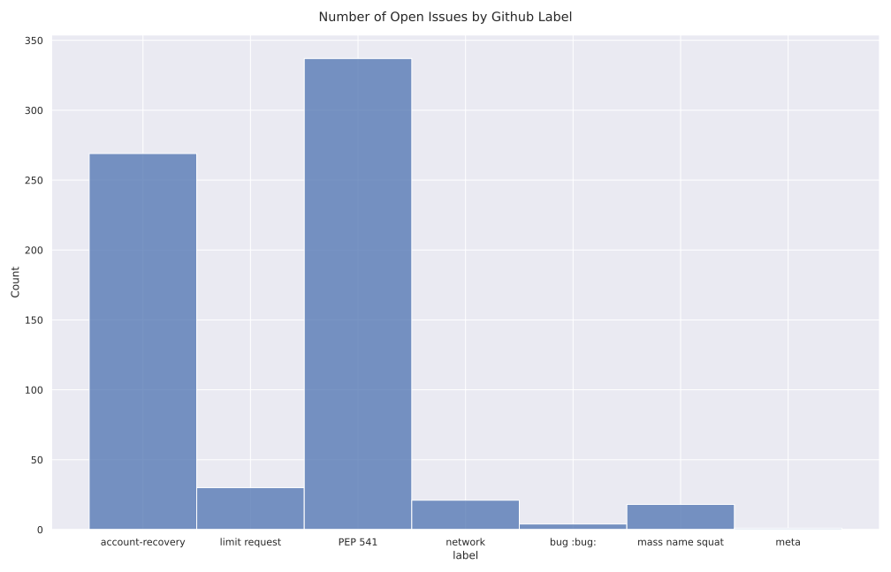
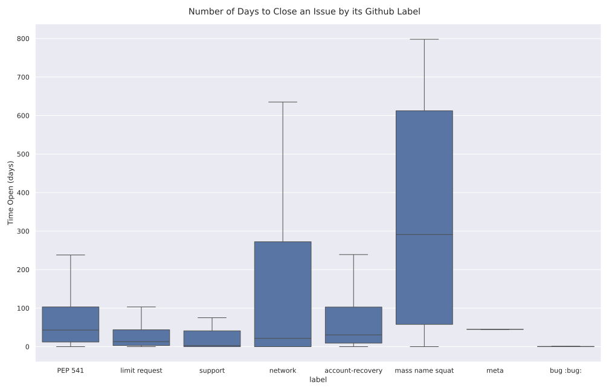

# PyPi Issues

There was a job opening for a support specialist at the PSF, which would require one to help with the issues in the PyPi/support repository. As I was interested in applying for the job, I downloaded all the issues via the github api and then made some plots because apparently I have a compulsion to plot everything.

The first thing I want to know was how many issues are we talking about here? Well, it turns out last year alone there were about 1000 issues created.

You can see a steady increase every year, guess it makes sense as to why they'd need to hire someone to help.

The next question is what kind of issues are there?

Most of them have to do with recovering an account or taking over a package namespace, but there are also issues about increasing a packages size limit and network problem issues!

Finally how long does it take to solve these types of issues?

Well if I'm hired, I'll definitely do my best to get those numbers down!
