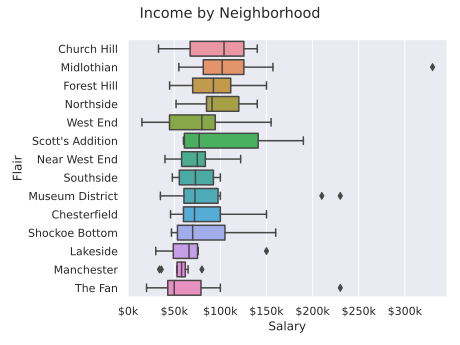
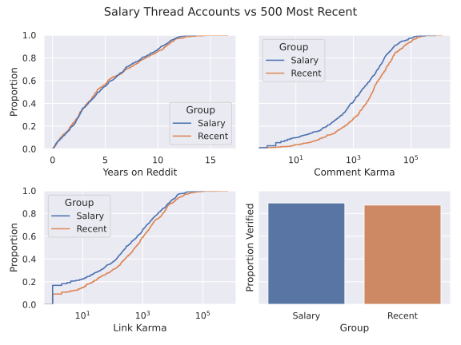

**Background:** A while ago there was a [salary transparency thread](https://www.reddit.com/r/rva/comments/11lvneq/rva_salary_transparency_thread/) posted in my local city subreddit. I was curious as to what the distribution looked like so I downloaded and used a (pair of) funky regular expressions to extract the salary from each top level comment. 

In general the salaries posted were higher than one would expect for the area, but that's self selection bias for you. 

Some users have the neighborhood they live in listed next to their username. This data allows us to compare income across neighborhoods. Only neighborhoods with 7+ datapoints were included in the graph.

One of the questions I had is if there was any relation between a redditor's karma/time on reddit/comment score with their salary. I didn't really think there would be and from visual inspection that seems to be the case, but you can't really know unless you look!

One of the last questions I had was whether the commenters on the transparency thread were any different that the commenters who usually comment on the subreddit. So I made a script to gather the 500 most recent comments on the subreddit and compared their account age, comment/link karma, and verified status to those who posted on the salary transparency thread.

The results line up with the idea that many people were using "lurker" or non main accounts to comment on the thread for an increased sense of anonymity. It doesn't support the idea that there were a lot of newly created accounts to comment on the thread (the age distribution of the accounts were about the same).

Overall a fun little project.
